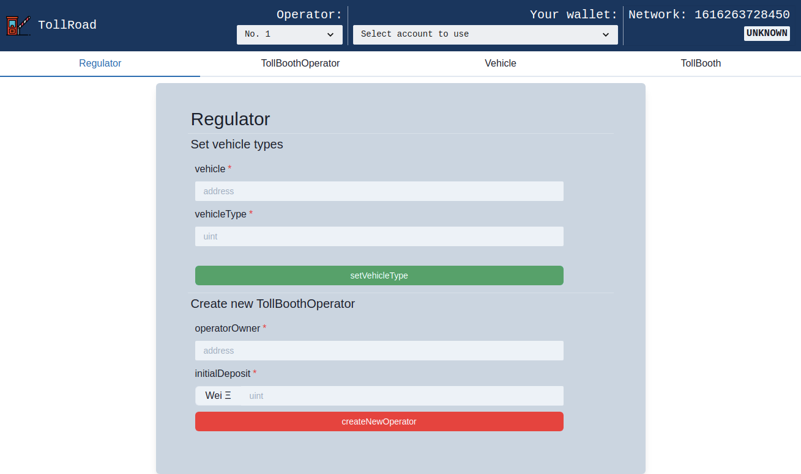
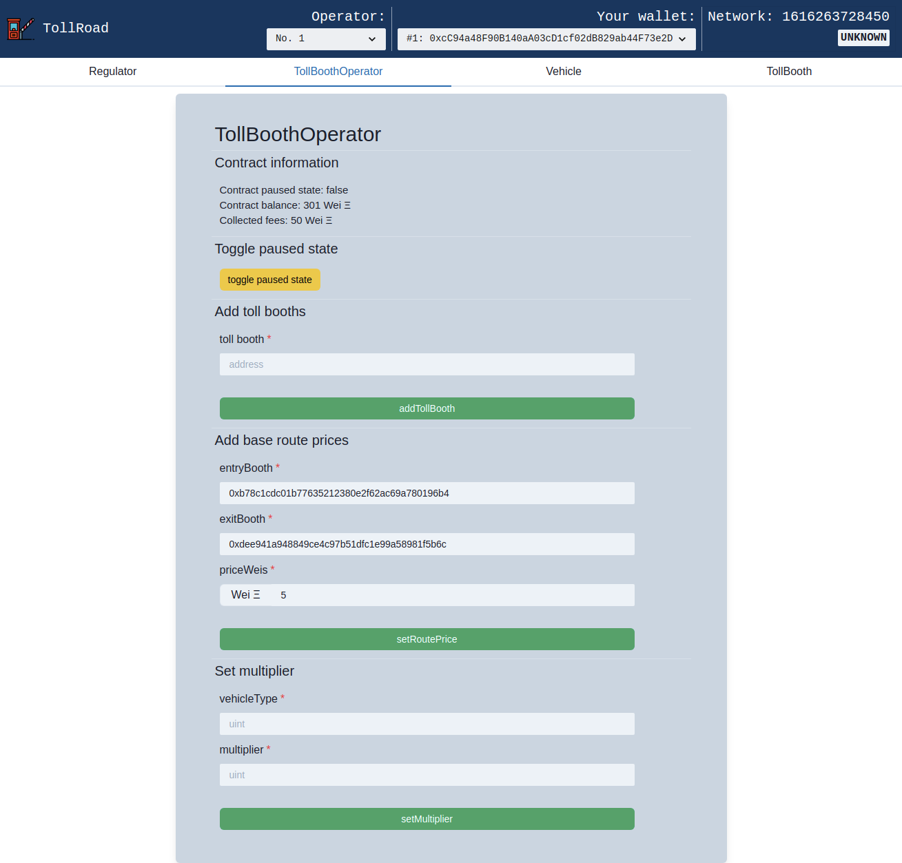
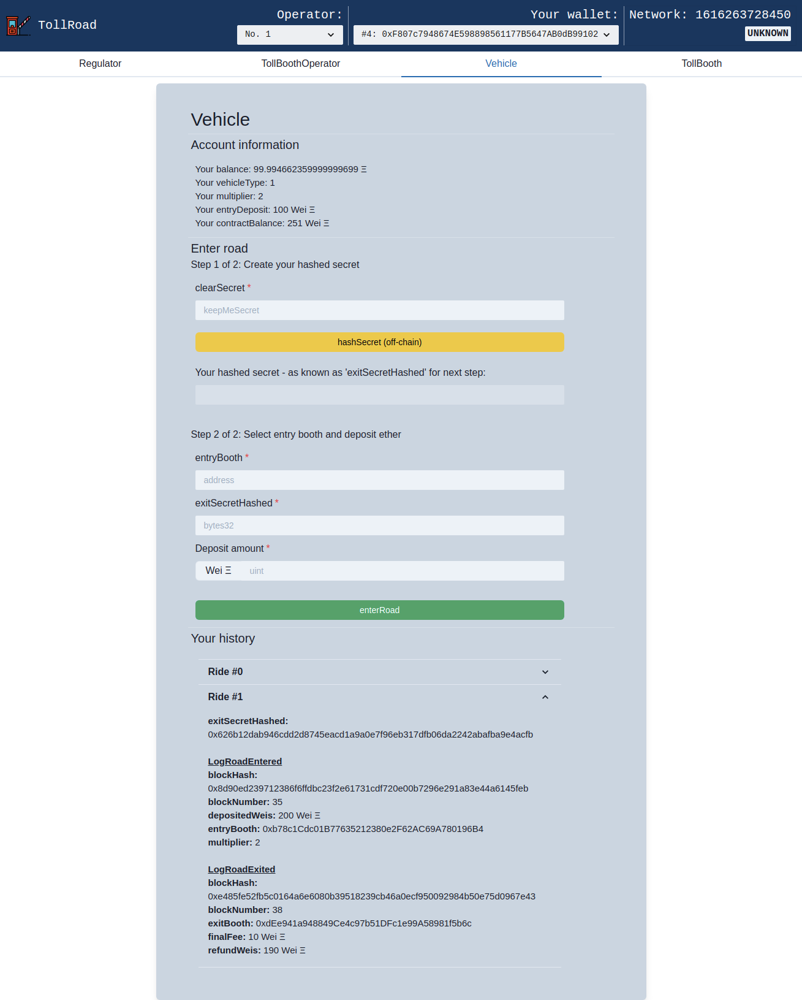
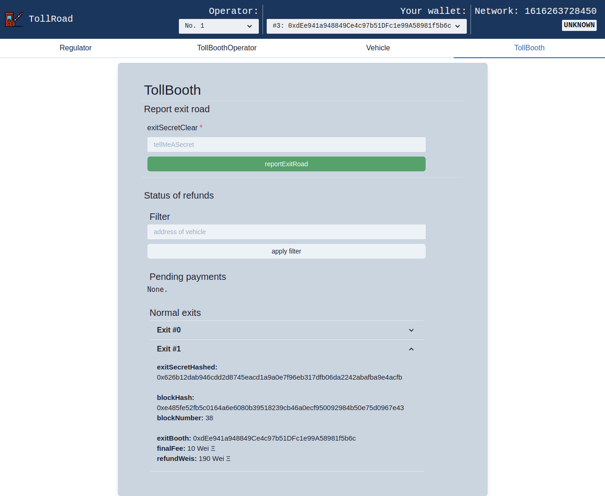

# Ethereum Developer Certification

This is an excerpt from the final exam of the Ethereum Developer Course by [B9lab](https://academy.b9lab.com) that led to my [Ethereum Developer certification](https://certificates.b9lab.com/certificate.html?uuid=04e3aad4-3d1f-4758-a30a-dda07ad821be).

## Project: Toll Road System

### Task (by B9lab)
..without revealing too much:
> Our project describes a road system that will be represented by 2 overarching smart contracts:
>
> * `Regulator`
> * `TollBoothOperator`
>
> These other elements of the system are represented by externally owned accounts:
>
> * owner of `Regulator`
> * owner of `TollBoothOperator`
> * individual vehicles
> * individual toll booths

## Screenshots of the developed application 'TollRoadApp'

### Regulator

### Operator

### Vehicle

### Booth
